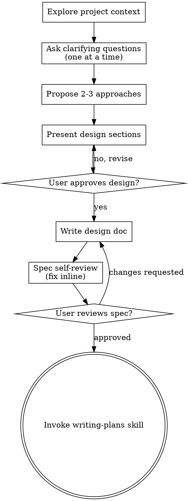

# Brainstorming Ideas Into Designs

Help turn ideas into fully formed designs and specs through natural collaborative dialogue.

<HARD-GATE>
**Skip this skill entirely if:**
- A specific file AND a specific change are both already stated in the request
- The user is asking you to edit, rename, move, or refactor a named thing in a named location

This skill is for open-ended work where the design itself needs to be figured out.
</HARD-GATE>

Start by understanding the current project context, then ask questions one at a time to refine the idea. Once you understand what you're building, present the design and get user approval.

<HARD-GATE>
Do NOT write any code, scaffold any project, or take any implementation action until you have presented a design and the user has approved it.
</HARD-GATE>

## Checklist

You MUST create a task for each of these items and complete them in order:

1. **Explore project context** — check files, docs, recent commits
2. **Ask clarifying questions** — one at a time, understand purpose/constraints/success criteria
3. **Propose 2-3 approaches** — with trade-offs and your recommendation
4. **Present design** — in sections scaled to complexity, get user approval after each section
5. **Write design doc** — save to `docs/specs/YYYY-MM-DD-<topic>-design.md` and commit
6. **Spec self-review** — quick inline check for placeholders, contradictions, ambiguity, scope
7. **User reviews written spec** — ask user to review before proceeding
8. **Transition to implementation** — invoke writing-plans skill

## Process Flow

**The terminal state is invoking writing-plans.** Do NOT invoke any other implementation skill.

## The Process

**Understanding the idea:**

- Check out the current project state first (files, docs, recent commits)
- Assess scope: if the request covers multiple independent subsystems, flag this and help decompose first
- Ask questions one at a time — only one question per message
- Focus on: purpose, constraints, success criteria
- Prefer multiple choice questions when possible

**Exploring approaches:**

- Propose 2-3 different approaches with trade-offs
- Lead with your recommended option and explain why

**Presenting the design:**

- Present sections scaled to complexity (a few sentences if simple, up to 200-300 words if nuanced)
- Ask after each section whether it looks right
- Cover: architecture, components, data flow, error handling

**Working in existing codebases:**

- Explore the current structure before proposing changes
- Follow existing patterns
- Where existing code has problems that affect the work, include targeted improvements
- Don't propose unrelated refactoring

## After the Design

**Documentation:**

- Write the validated design to `docs/specs/YYYY-MM-DD-<topic>-design.md`
- Commit the design document to git

**Spec Self-Review:**

1. **Placeholder scan:** Any "TBD", "TODO", incomplete sections? Fix them.
2. **Internal consistency:** Do any sections contradict each other?
3. **Scope check:** Focused enough for a single implementation plan?
4. **Ambiguity check:** Could any requirement be interpreted two different ways? Pick one.

**User Review Gate:**

> "Spec written and committed to `<path>`. Please review it and let me know if you want any changes before we start the implementation plan."

Wait for the user's response. Only proceed once the user approves.

## Key Principles

- **One question at a time** — don't overwhelm
- **YAGNI ruthlessly** — remove unnecessary features
- **Explore alternatives** — always propose 2-3 approaches
- **Incremental validation** — present design, get approval before moving on
