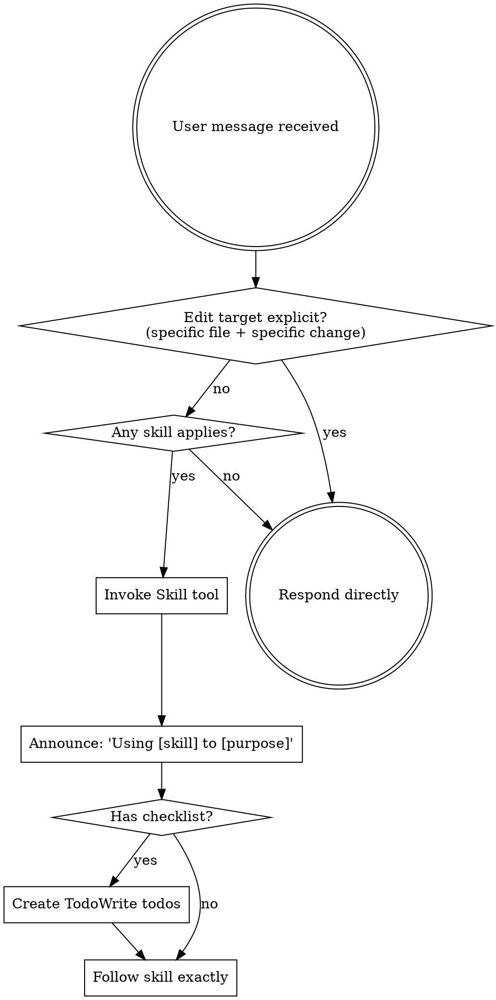

<SUBAGENT-STOP>
If you were dispatched as a subagent to execute a specific task, skip this skill.
</SUBAGENT-STOP>

## Instruction Priority

User instructions always take precedence:

1. **User's explicit instructions** (CLAUDE.md, direct requests) — highest priority
2. **Skills** — override default behavior where they conflict
3. **Default system prompt** — lowest priority

## The Rule

**If the edit target is explicit, act directly. If the task is open-ended, check for skills first.**

An "explicit edit target" means: a specific file AND a specific change are both stated in the request.

- `"edit theme.css to rename .accent-yellow to .u-accent-yellow"` → explicit → act directly
- `"add a new stage section"` → open-ended → check for skills
- `"fix the bug in SlideGrid where columns don't align"` → approach unclear → check for skills

## Decision Flow

## How to Access Skills

**In Claude Code:** Use the `Skill` tool. When you invoke a skill, its content is loaded and presented to you — follow it directly. Never use the Read tool on skill files.

## Skill Priority

When multiple skills could apply:

1. **Process skills first** (brainstorming, writing-plans) — determine HOW to approach the task
2. **Implementation skills second** — guide execution

## Skill Types

**Rigid**: Follow exactly. Don't adapt away discipline.

**Flexible**: Adapt principles to context.

The skill itself tells you which type it is.
